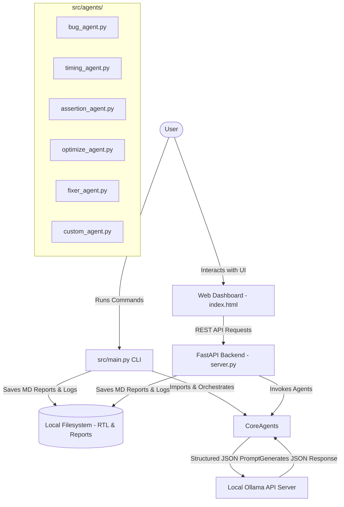

# 🤖 RTL Analyzing & Verification AI Agent

[](https://python.org)
[](https://fastapi.tiangolo.com)
[](https://ollama.com)
[](#)
[](#)

A localized, multi-agent AI verification suite designed for hardware designers to analyze, optimize, verify (via SVA), and automatically repair **SystemVerilog/Verilog** code using local LLMs. Run completely offline and secure to keep proprietary RTL designs local.

---

## 📌 Table of Contents

- [Overview](#-overview)
- [Key Features](#-key-features)
- [System Architecture](#-system-architecture)
- [Specialized Agents](#-specialized-agents)
- [Directory Structure](#-directory-structure)
- [Getting Started](#-getting-started)
  - [Prerequisites](#prerequisites)
  - [Installation](#installation)
  - [Ollama Setup](#ollama-setup)
- [Running the Application](#-running-the-application)
  - [1. Launch the Web Dashboard](#1-launch-the-web-dashboard)
  - [2. CLI-Based Multi-Agent Analysis](#2-cli-based-multi-agent-analysis)
  - [3. Running Phase Pipeline Scripts](#3-running-phase-pipeline-scripts)
- [Configuration](#-configuration)
- [Evaluation Case Study (`counter.sv`)](#-evaluation-case-study-countersv)

---

## 🔍 Overview

Static analysis tools catch syntax errors, but finding functional bugs, timing violations, clock domain crossing (CDC) mismatches, or latch inferences usually requires complex linting tools or extensive simulation.

This suite provides a local, **FastAPI-powered web platform** and **CLI suite** that orchestrates multiple specialized AI agents. Each agent queries an offline Ollama LLM with structured, system-engineered prompts to perform hardware verification and code optimization.

---

## ✨ Key Features

1. **🔒 100% Offline & Private:** Queries a local Ollama instance. No code is transmitted to cloud APIs.
2. **🧠 Specialized Multi-Agent Architecture:** Features distinct agents for Bug Analysis, Timing Paths, SystemVerilog Assertion (SVA) generation, Design Optimization, and Auto-Fixing.
3. **⚡ Parallel & Sequential Execution:** Analyze RTL modules concurrently utilizing thread pools or sequentially to conserve CPU resources.
4. **🎨 High-End Glassmorphic GUI:** Visual dashboard built with clean web designs, featuring:
   - Cosmic glowing background and responsive dark-mode styling.
   - Interactive files panel (Create, Edit, Save, Delete RTL files).
   - Real-time LLM agent logs, timing breakdowns, and severity indicators.
   - Live AI code generation & diff updates.
   - Inline direct LLM chat interface for active files.
5. **📊 Markdown Report Generation:** Automatically saves formatted Markdown reports in `reports/` for both CLI and GUI executions.

---

## 🏗️ System Architecture

The following diagram illustrates how the frontend GUI, CLI suite, FastAPI backend, specialized agents, and Ollama server interact:



---

## 🤖 Specialized Agents

All agents inherit from a common base class in [src/core/base_agent.py](file:///d:/PSProject/src/core/base_agent.py) which handles timeout management, structured JSON API calls to Ollama, and execution logging.

*   **🐛 Bug Agent** ([src/agents/bug_agent.py](file:///d:/PSProject/src/agents/bug_agent.py)): Analyzes logic for latch inference, clock-domain crossing (CDC) issues, reset polarity, blocking assignments inside sequential always blocks, and bit-width mismatches.
*   **⏱️ Timing Agent** ([src/agents/timing_agent.py](file:///d:/PSProject/src/agents/timing_agent.py)): Evaluates RTL for excessive logic depth, potential setup/hold violations, combinational loops, and gated clock issues.
*   **✍️ Assertion Agent** ([src/agents/assertion_agent.py](file:///d:/PSProject/src/agents/assertion_agent.py)): Automatically crafts SystemVerilog Assertions (SVA) properties, sequences, and binding directives to verify the functional requirements of the module.
*   **📈 Optimizer Agent** ([src/agents/optimize_agent.py](file:///d:/PSProject/src/agents/optimize_agent.py)): Recommends structural RTL transformations for minimizing logic area, reducing dynamic power consumption, and optimizing critical timing paths.
*   **🔧 Fixer Agent** ([src/agents/fixer_agent.py](file:///d:/PSProject/src/agents/fixer_agent.py)): Processes code logs and lists of detected issues to automatically refactor and fix the SystemVerilog file.
*   **💬 Custom Agent** ([src/agents/custom_agent.py](file:///d:/PSProject/src/agents/custom_agent.py)): Answers custom user questions directly relating to the active Verilog file.

---

## 📁 Directory Structure

```text
D:\PSProject
├── config/
│   └── settings.json                     # Ollama connections and default parameters
├── docs/
│   ├── assignment_requirements.md        # Hardware specification prompts & exercises
│   └── phase1_evaluation.md              # Baseline testing of Ollama models
|   └── phase2_evaluation.md
|   └── phase3_evaluation.md
|   
├── logs/                                 # Runtime JSONL execution logs for agents
├── reports/                              # Generated Markdown verification reports
│   └── reference/                        # Reference reports for Phase 3 models
├── rtl_files/                            # Workspace directory for SystemVerilog files (*.sv, *.v)
│   ├── alu.sv
│   ├── cdc_pointer_sync.sv
│   ├── counter.sv
│   ├── dma_fifo_deadlock.sv
│   ├── fifo.sv
│   ├── fsm.sv
│   └── round_robin_arbiter.sv
├── src/
│   ├── agents/                           # Specialized verification and fixing agents
│   │   ├── assertion_agent.py
│   │   ├── bug_agent.py
│   │   ├── custom_agent.py
│   │   ├── fixer_agent.py
│   │   ├── optimize_agent.py
│   │   └── timing_agent.py
│   ├── core/                             # Base classes and global configurators
│   │   ├── base_agent.py
│   │   └── config.py
│   ├── web/                              # GUI web server (FastAPI) and assets
│   │   ├── server.py
│   │   └── static/
│   │       ├── css/
│   │       │   └── style.css             # Glassmorphic dark styling
│   │       ├── js/
│   │       │   └── app.js                # Frontend controls and REST integrations
│   │       └── index.html                # Single-page visual interface
│   └── main.py                           # Master CLI verification orchestrator
├── analyze.py                            # Phase 1 simple testing utility
├── phase2_agent.py                       # Phase 2 single-agent folder-run pipeline
├── run_all_agents.py                     # Phase 3 parallel-agent master script
├── requirements.txt                      # Python dependencies
└── README.md                             # Project Documentation (You are here)
```

---

## 🚀 Getting Started

### Prerequisites

*   **Python:** Version `3.10` or newer.
*   **Ollama:** Installed and running locally. Download from [ollama.com](https://ollama.com).

### Installation

1.  **Clone the workspace** or navigate into the project directory:
    ```bash
    cd D:\PSProject
    ```
2.  **Create and activate a virtual environment**:
    ```bash
    python -m venv venv
    # Windows Command Prompt:
    venv\Scripts\activate.bat
    # Windows PowerShell:
    .\venv\Scripts\Activate.ps1
    ```
3.  **Install dependencies**:
    ```bash
    pip install -r requirements.txt
    ```

### Ollama Setup

1.  Make sure Ollama service is active.
2.  Pull the required LLM model (e.g., `qwen2.5:3b`, `mistral`, or `codellama`):
    ```bash
    ollama pull qwen2.5:3b
    ollama pull mistral
    ```

---

## 💻 Running the Application

### 1. Launch the Web Dashboard

To run the responsive FastAPI app, execute:
```bash
python -m uvicorn src.web.server:app --reload --host 127.0.0.1 --port 8000
```
Open [http://127.0.0.1:8000](http://127.0.0.1:8000) in your web browser. You will find:
*   An active list of SystemVerilog modules from the `rtl_files/` folder.
*   Model selector populated dynamically from your local Ollama API.
*   A toggling capability for Sequential vs. Parallel execution.
*   A detailed interactive dashboard breaking down structural feedback, timing risk, coverage metrics, and optimization recommendations.
*   An **Auto-Fix** action button that submits details to the [Fixer Agent](file:///d:/PSProject/src/agents/fixer_agent.py) to patch issues inline.
*   A direct chat input to run custom verification prompts on the active file.

### 2. CLI-Based Multi-Agent Analysis

Run multi-agent analysis on any specific file or complete directory directly from the console:
```bash
# Run analysis on a specific file using the default model (sequential)
python src/main.py --file rtl_files/counter.sv

# Run analysis on all files in a folder using 'mistral' in parallel mode
python src/main.py --file rtl_files/ --model mistral --parallel
```
Generated reports are saved in `reports/` as markdown files (e.g. `reports/counter_cli_report.md`).

### 3. Running Phase Pipeline Scripts

You can also run historical pipeline scripts from earlier development phases:
```bash
# Phase 1 simple run
python analyze.py

# Phase 2 pipeline (scans folder using standard prompt rules)
python phase2_agent.py

# Phase 3 parallel verification master script
python run_all_agents.py
```

---

## ⚙️ Configuration

Configure backend defaults in [config/settings.json](file:///d:/PSProject/config/settings.json):

```json
{
  "ollama_url": "http://localhost:11434",
  "default_model": "qwen2.5:3b",
  "timeout": 600,
  "temperature": 0.1
}
```
*   `ollama_url`: The address where your local Ollama server is running (default `http://localhost:11434`).
*   `default_model`: The default model loaded by agents if none is specified (default `qwen2.5:3b`).
*   `timeout`: HTTP request timeout in seconds (useful for CPU-bound inference).
*   `temperature`: Sampling temperature for the model (default `0.1` for consistent, deterministic analyses).

---

## 📊 Evaluation Case Study (`counter.sv`)

### The Challenge
A basic counter module [rtl_files/counter.sv](file:///d:/PSProject/rtl_files/counter.sv):
```systemverilog
module counter (
    input clk,
    input rst,
    output reg [3:0] count
);
    always @(posedge clk) begin
        if (rst)
            count = 0;      
        else
            count = count + 1;
    end
endmodule
```

### The Bug
Inside `always @(posedge clk)`, **blocking assignment `=`** is used instead of **non-blocking `<=`**. This introduces potential race conditions in simulation and discrepancies against synthesized gates.

### Baseline vs. Agent Performance
During **Phase 1 baseline evaluation** ([docs/phase1_evaluation.md](file:///d:/PSProject/docs/phase1_evaluation.md)), base models were queried directly without system roles or structured environments:
*   **mistral:** Found *no bugs*. Claimed code was functional and proposed adding unnecessary timing constraints and clock enables.
*   **codellama:** Found *no bugs*. Suggested output registers should be wires (invalid syntax for behavioral blocks).
*   **qwen2.5:3b:** Found *no bugs*. Suggested changing non-existent blocks and signals (hallucinated `always_comb` block and signals like `rst_n`).


### The Agent Solution
With the **RTL analyzing agents** running specialized verification prompts:
1.  **Bug Agent** immediately spots the blocking assignment (`=`), reports the exact line and issue, details the race-condition impact, and proposes the non-blocking (`<=`) fix.
2.  **Timing Agent** checks setup/hold risks and logic depth.
3.  **Assertion Agent** generates temporal logic assertions verifying the reset and increment functionality:
    ```systemverilog
    property p_reset;
      @(posedge clk) rst |=> (count == 0);
    endproperty
    assert property (p_reset);
    ```
4.  **Fixer Agent** automatically patches the blocking assignment and returns compile-ready, safe RTL.
