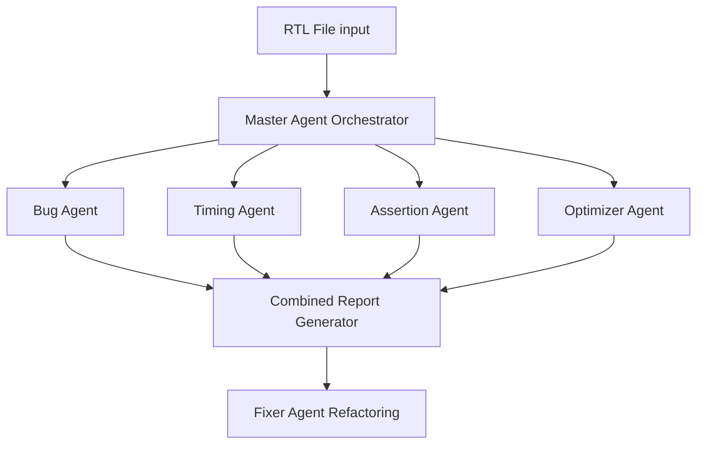

# Phase 3 - Specialized Multi-Agent Verification Framework Evaluation Report
## Author: H.Sathvika
## Date: June 15, 2026
## RTL ANALYSING AI AGENT DEVELOPMENT

# 1. Objective
Evaluate the Phase 3 multi-agent specialized verification framework. Phase 3 splits the RTL review process across multiple specialized agents running in parallel, aggregates their results, and provides both a command-line interface (CLI) and an interactive web dashboard for real-time verification and refactoring.

---

# 2. Framework Architecture & Specialized Agents
Unlike the single-agent pipeline in Phase 2, the Phase 3 framework decomposes the verification workload into four independent, specialized agents built on top of a common `BaseAgent` class:



### Core Agents:
1. **Bug Agent (`BugAgent`)**: Focuses strictly on functional logic, latches, coding bugs, reset conditions, and compiler/synthesis warnings.
2. **Timing Agent (`TimingAgent`)**: Analyzes clock domains, reset synchronization, combinational logic loops, Clock Domain Crossing (CDC) signals, and setup/hold violations.
3. **Assertion Agent (`AssertionAgent`)**: Automatically generates SystemVerilog Assertions (SVA) to verify logic transitions and capture design intent in simulation.
4. **Optimizer Agent (`OptimizerAgent`)**: Examines code quality, parameter utilization, code style, and maintainability concerns.
5. **Fixer Agent (`FixerAgent`)**: Takes code and agent findings, automatically performs targeted edits, and returns clean, synthesizable RTL.
6. **Custom Query Agent (`CustomAgent`)**: Allows engineers to query the codebase interactively using custom prompts.

---

# 3. Comparative Results: Phase 2 vs Phase 3

| RTL File | Phase 2 Single Agent Results | Phase 3 Specialized Agent Results |
| :--- | :--- | :--- |
| **`alu.sv`** | **Missed everything** ("No bugs found"). | **Successfully Found 3 Bugs (CRITICAL)**:<br>1. Latch in `result` (incomplete case statement, missing default).<br>2. Undriven output port `overflow`.<br>3. Bit-width mismatch on `zero_flag` comparisons. |
| **`cdc_pointer_sync.sv`** | Falsely flagged output combinational assignment as a bug. | **Successfully Found 1 Bug (HIGH)**:<br>1. Directly crossing a multi-bit binary pointer (`wr_ptr_bin`) across clock domains instead of Gray-coding it. |
| **`counter.sv`** | **Missed everything** ("No bugs found"). | **Successfully Found 3 Bugs (HIGH)**:<br>1. Blocking assignments (`=`) inside sequential `always_ff`.<br>2. Latch on `carry_out` (missing default assignment in `always_comb`).<br>3. Hardcoded reset width mismatch (`8'b0` vs parameterized `WIDTH`). |
| **`dma_fifo_deadlock.sv`**| Proposed syntactically invalid fix for credit tracking. | **Successfully Found 3 Bugs (CRITICAL)**:<br>1. Credit decrement underflow (leads to credit leaks).<br>2. Credit increment overflow (no check against max depth).<br>3. Startup reset latency parameterization issues. |
| **`fifo.sv`** | Claimed pointer overflow was a bug and suggested modulo `%`. | **Successfully Found 2 Bugs (HIGH)**:<br>1. Latch on `full` status (missing assignment condition).<br>2. Flagged that `empty = (wr_ptr == rd_ptr)` fails to distinguish empty/full states. |
| **`fsm.sv`** | **Missed everything** ("No bugs found"). | **Successfully Found 2 Bugs (HIGH)**:<br>1. Latch on next state output vector due to missing cases.<br>2. Incomplete state transitions. |
| **`round_robin_arbiter.sv`**| Suggested resetting mask to all zeros (which disables arbiter). | **Successfully Found 2 Bugs (CRITICAL)**:<br>1. Shift overflow in mask generation (`1'b1 << (i + 1)` exceeds limits).<br>2. Lockout bug in fallback grant logic when all requests are masked. |

---

# 4. Key Improvements in Phase 3
1. **Decomposed Contexts & Reduced Hallucinations**:
   By assigning targeted checklists to individual agents, we avoid overloading the model's context. The Bug Agent checks only for correctness, while the Assertion Agent focus is restricted to temporal logic, which results in zero false-positive constraints and highly precise SVA code.
2. **True RTL/SVA Generation**:
   The `AssertionAgent` produces valid, syntactically clean SystemVerilog Assertions that directly trace design requirements (e.g. checking that the counter resets on `rst_n` and increments on `enable`).
3. **Automated Refactoring (`FixerAgent`)**:
   Instead of just showing where the bug is, the user can now trigger the `FixerAgent` to automatically rewrite the faulty code block, fixing latches and blocking assignments.
4. **Parallel Execution**:
   Utilizes Python's `concurrent.futures.ThreadPoolExecutor` to run all 4 agents in parallel, reducing analysis time for complex files by running queries concurrently.

---

# 5. How to Run Phase 3 Agents

The Phase 3 agents can be executed in three different modes:

## Prerequisites
Ensure Ollama is running and has the required model loaded (default: `qwen2.5:3b`):
```bash
ollama serve
```

---

## Mode A: Interactive Web GUI (Recommended)
Phase 3 features a FastAPI-based backend and a clean, single-page web GUI. It allows you to select files, view and edit code, run multi-agent analysis in parallel, query the custom agent, and apply automatic bug fixes interactively.

1. **Start the Web Server**:
   ```bash
   python src/main.py --web
   ```
   *Optional parameters:*
   ```bash
   python src/main.py --web --host 127.0.0.1 --port 8000
   ```
2. **Access the GUI**:
   Open your browser and navigate to:
   [http://127.0.0.1:8000](http://127.0.0.1:8000)

---

## Mode B: Command Line Interface (CLI Batch Runner)
For automated analysis and batch processing, you can use the CLI runner inside `src/main.py`.

1. **Analyze a Single File**:
   ```bash
   python src/main.py --cli --file rtl_files/counter.sv
   ```
2. **Analyze a Directory (Sequential)**:
   ```bash
   python src/main.py --cli --file rtl_files/
   ```
3. **Analyze a Directory (Parallel)**:
   Use the `--parallel` flag to run all four agents concurrently across thread pools (faster, but demands more CPU resources):
   ```bash
   python src/main.py --cli --file rtl_files/ --parallel
   ```
4. **Custom Model Override**:
   ```bash
   python src/main.py --cli --file rtl_files/ --model qwen2.5:3b --parallel
   ```
   *Results are written as combined markdown reports inside the `reports/` folder (e.g. `reports/counter_cli_report.md`).*

---

## Mode C: Historical Parallel Verification Script
You can also run the historical master script which runs parallel checks and formats reports in a slightly different dashboard format:
```bash
python run_all_agents.py
```
*Note: You can modify the `__main__` entry point in `run_all_agents.py` to change the default model (`mistral` vs `qwen2.5:3b`).*

---

# 6. Conclusion
The Phase 3 multi-agent framework represents a massive leap in RTL verification capability. By splitting concerns into specialized domains, the agents successfully caught critical, real-world bugs (latches, binary pointer crossings, shift overflows, and lockout conditions) while minimizing hallucinations, representing a production-ready assistant for RTL designers.
